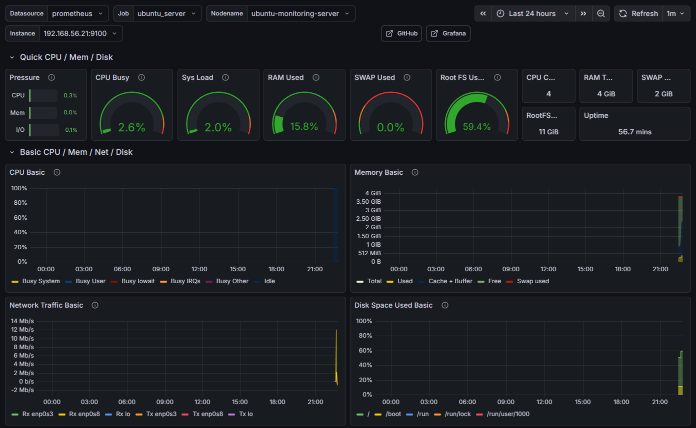

# Cross-Platform Monitoring Infrastructure

A production-ready monitoring solution using Prometheus and Grafana to monitor Windows Server and Ubuntu systems with real-time metrics and alerting.



## Project Overview

This project demonstrates enterprise monitoring infrastructure setup across Windows and Linux environments. It includes:

- **Prometheus** for metrics collection and alerting
- **Grafana** for visualization and dashboards
- **Node Exporter** for Linux system metrics
- **Windows Exporter** for Windows system metrics
- Real-time alerts for CPU, memory, disk, and service availability

## Features

- Cross-platform monitoring (Windows + Linux)
- Real-time metric collection every 15 seconds
- Automated alerts for system health issues
- Beautiful Grafana dashboards
- Exportable configurations
- Infrastructure-as-code approach

## Architecture

```
┌─────────────────┐         ┌──────────────────┐
│  Ubuntu Server  │◄────────┤   Prometheus     │
│ (Node Exporter) │  :9100  │   (Collector)    │
└─────────────────┘         └────────┬─────────┘
                                     │
┌─────────────────┐                  │ :9090
│ Windows Server  │◄─────────────────┤
│(Windows Export) │  :9182           │
└─────────────────┘         ┌────────▼─────────┐
                           │     Grafana      │
                           │  (Visualization) │
                           └──────────────────┘
                                    :3000
```

## Quick Start

### Prerequisites

- Ubuntu Server 22.04 LTS
- Windows Server 2019/2022
- Network connectivity between servers

### Network Configuration

This setup uses **bridged network mode** with the following static IP addresses:

- **Windows Server**: `192.168.56.20`
- **Ubuntu Server**: `192.168.56.21`

### Installation

**1. Install Prometheus & Node Exporter on Ubuntu:**

```bash
chmod +x scripts/install_prometheus.sh
chmod +x scripts/install_node_exporter.sh
./scripts/install_prometheus.sh
./scripts/install_node_exporter.sh
```

After installation, create the systemd service files and start the services:

```bash
# Create Prometheus service
sudo nano /etc/systemd/system/prometheus.service
# (Add service configuration)

# Create Node Exporter service
sudo nano /etc/systemd/system/node_exporter.service
# (Add service configuration)

# Start services
sudo systemctl daemon-reload
sudo systemctl start prometheus
sudo systemctl enable prometheus
sudo systemctl start node_exporter
sudo systemctl enable node_exporter
```

**2. Install Windows Exporter on Windows:**

- Download from [releases](https://github.com/prometheus-community/windows_exporter/releases)
- Run MSI installer with default settings
- Configure Windows Firewall to allow port 9182:

```powershell
# Run in PowerShell as Administrator
New-NetFirewallRule -DisplayName "Prometheus Windows Exporter" -Direction Inbound -Protocol TCP -LocalPort 9182 -Action Allow
```

**3. Configure Prometheus:**

```bash
sudo cp configs/prometheus/prometheus.yml /etc/prometheus/
sudo cp configs/prometheus/alert_rules.yml /etc/prometheus/
# Edit prometheus.yml and replace IP addresses if needed
sudo systemctl restart prometheus
```

**4. Install Grafana:**

```bash
# Install dependencies
sudo apt-get install -y software-properties-common

# Add Grafana repository
sudo mkdir -p /etc/apt/keyrings/
wget -q -O - https://apt.grafana.com/gpg.key | gpg --dearmor | sudo tee /etc/apt/keyrings/grafana.gpg > /dev/null
echo "deb [signed-by=/etc/apt/keyrings/grafana.gpg] https://apt.grafana.com stable main" | sudo tee /etc/apt/sources.list.d/grafana.list

# Update and install
sudo apt-get update
sudo apt-get install grafana

# Start Grafana
sudo systemctl start grafana-server
sudo systemctl enable grafana-server
```

**5. Configure Grafana:**

- Open browser: `http://192.168.56.21:3000`
- Login with: `admin` / `admin` (set new password when prompted)
- Add Prometheus data source:
  - Go to Settings → Data Sources → Add data source
  - Select "Prometheus"
  - URL: `http://localhost:9090`
  - Click "Save & Test"

**6. Import Dashboards:**

- **Linux Metrics**: Import dashboard ID `1860` (Node Exporter Full)
- **Windows Metrics**: Import dashboard ID `14694` (Windows Exporter)

## Metrics Collected

### Linux (Node Exporter)

- CPU usage, load average
- Memory usage and swap
- Disk space and I/O
- Network traffic
- System uptime

### Windows (Windows Exporter)

- CPU utilization
- Memory usage
- Disk performance
- Network statistics
- Service status

## Alert Rules

| Alert | Threshold | Duration |
|-------|-----------|----------|
| High CPU | >80% | 2 minutes |
| High Memory | >85% | 2 minutes |
| Low Disk Space | <20% | 5 minutes |
| Instance Down | N/A | 1 minute |

View alerts at: `http://192.168.56.21:9090/alerts`

## Project Structure

```
cross-platform-monitoring-infrastructure/
├── configs/
│   ├── prometheus/
│   │   ├── prometheus.yml       # Main Prometheus config
│   │   └── alert_rules.yml      # Alert definitions
│   └── grafana-dashboards/
│       ├── linux-node-exporter.json
│       └── windows-exporter.json
├── scripts/
│   ├── install_prometheus.sh
│   └── install_node_exporter.sh
├── docs/
├── screenshots/
│   ├── prometheus-service-status.png
│   ├── prometheus-homepage.png
│   ├── prometheus-targets-down.png
│   ├── node-exporter-service-status.png
│   ├── windows-exporter-metrics.png
│   ├── prometheus-targets-up.png
│   ├── grafana-service-status.png
│   ├── grafana-login-page.png
│   ├── grafana-prometheus-datasource.png
│   ├── node-exporter-dashboard.png
│   ├── windows-exporter-dashboard.png
│   ├── prometheus-alerts-page.png
│   ├── vm-list.png
│   ├── windows-to-ubuntu-ping-test.png
│   └── ubuntu-to-windows-ping-test.png
└── README.md
```

## What I Learned

- Setting up production monitoring infrastructure
- Configuring Prometheus scrape configs and alert rules
- Writing PromQL queries for system metrics
- Building Grafana dashboards from scratch
- Cross-platform metric collection strategies
- Alert threshold tuning and best practices

## Screenshots

### Setup & Verification
- `prometheus-service-status.png` - Prometheus service running and active
- `prometheus-homepage.png` - Prometheus web interface homepage
- `prometheus-targets-down.png` - Initial targets status (before exporters installed)
- `node-exporter-service-status.png` - Node Exporter service running
- `windows-exporter-metrics.png` - Windows Exporter metrics endpoint
- `prometheus-targets-up.png` - All targets showing UP status

### Grafana Configuration
- `grafana-service-status.png` - Grafana service running
- `grafana-login-page.png` - Grafana login/home page
- `grafana-prometheus-datasource.png` - Successful Prometheus data source connection

### Dashboards
- `node-exporter-dashboard.png` - Node Exporter Full dashboard (ID: 1860)
- `windows-exporter-dashboard.png` - Windows Exporter dashboard (ID: 14694)
- `prometheus-alerts-page.png` - Prometheus alerts page showing configured rules

### Network Setup
- `vm-list.png` - Virtual machine list
- `windows-to-ubuntu-ping-test.png` - ICMP connectivity test from Windows to Ubuntu
- `ubuntu-to-windows-ping-test.png` - ICMP connectivity test from Ubuntu to Windows

## Resources

- [Prometheus Documentation](https://prometheus.io/docs/)
- [Grafana Documentation](https://grafana.com/docs/)
- [Node Exporter Metrics](https://github.com/prometheus/node_exporter)
- [Windows Exporter](https://github.com/prometheus-community/windows_exporter)

## License

MIT License - See LICENSE file for details
